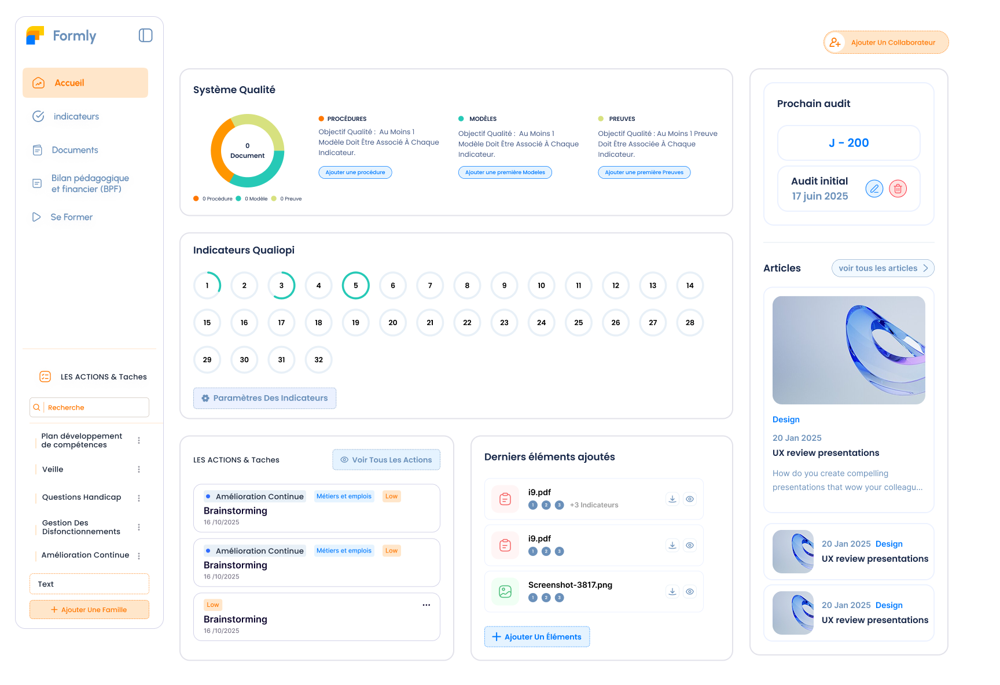
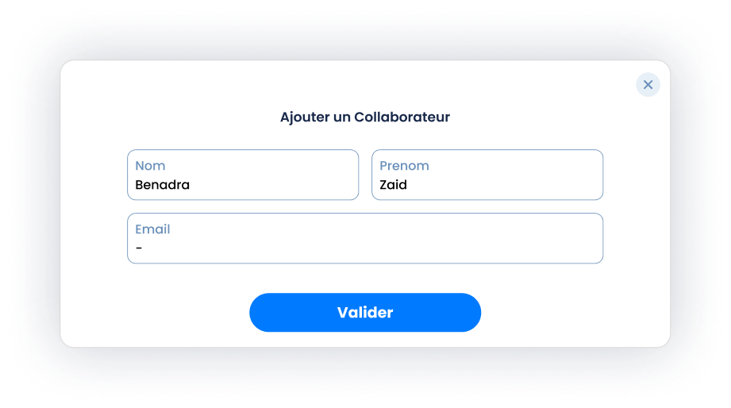
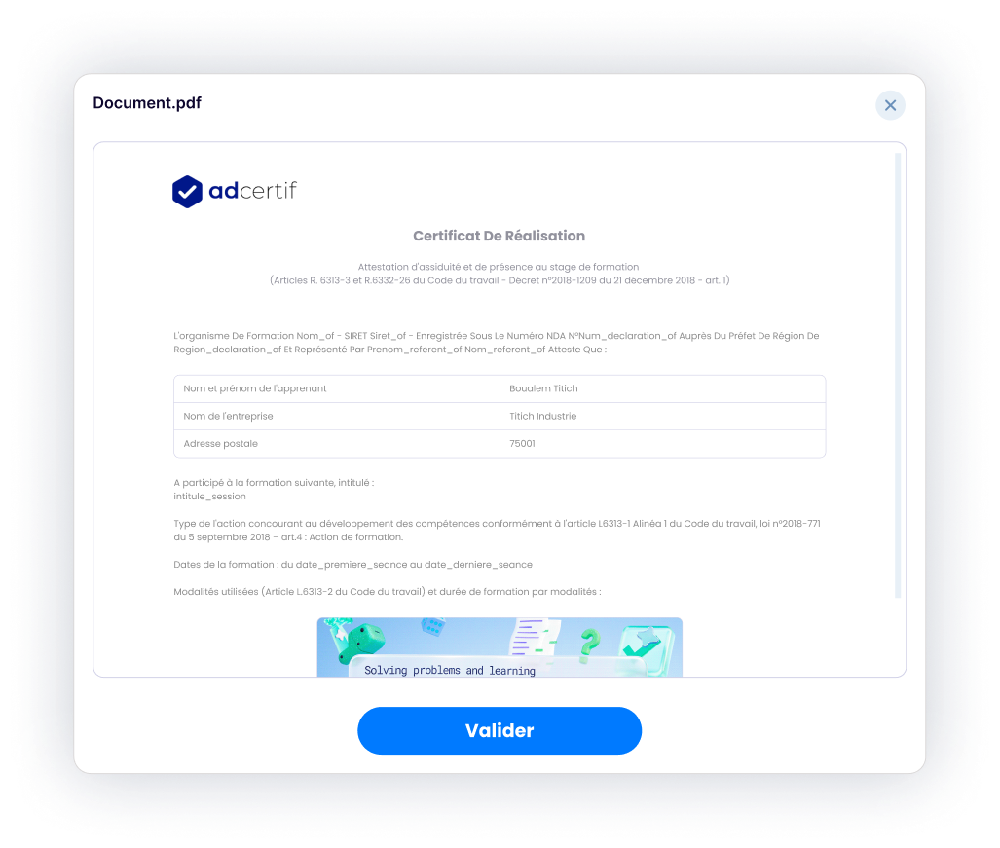

# Dashboard Qualité - Design Implementation Guide

## 📸 Design References

### Full Page


### Modals
| Modal | Preview |
|-------|---------|
| Add Collaborator |  |
| View Document |  |

**Figma Dev Mode Link**: [Insert your link]

---

## 📐 Layout Structure

### Desktop Layout (1728px+)
```
┌─────────────────────────────────────────────────────┐
│  [Sidebar]  │  [Main Content]  │  [Right Sidebar]  │
│   257px     │     1383px       │      344px        │
└─────────────────────────────────────────────────────┘
```

### Tablet Layout (768px - 1023px)
```
┌──────────────────────────────────┐
│  [☰]  [Main Content]            │
│       [Right Sidebar Below]      │
└──────────────────────────────────┘
```

### Mobile Layout (320px - 767px)
```
┌──────────────────┐
│  [☰ Menu]       │
│  [Content]      │
│  [Stacked]      │
└──────────────────┘
```

---

## 🎨 Design Tokens

All design tokens are extracted in `/tokens/`:
- `colors.css` - Color palette with CSS variables
- `typography.css` - Fluid typography system
- `spacing.css` - Responsive spacing scale
- `breakpoints.css` - Media query breakpoints

### Usage Example
```css
.component {
  color: var(--color-primary);
  font-size: var(--text-lg);
  padding: var(--space-6);
  border-radius: var(--radius-xl);
}
```

---

## 🔧 Component Specifications

### Main Dashboard Components

#### 1. Système Qualité Card
- **Type**: Card with donut chart
- **Height**: 255.49px
- **Features**:
  - Donut chart (3 segments)
  - Legend (Orange, Teal, Yellow-green)
  - Statistics columns
  - "Add" buttons for each type

#### 2. Indicateurs Qualiopi
- **Type**: Grid of circular indicators
- **Count**: 32 indicators
- **States**:
  - Active: Teal border (#26C9B6)
  - Inactive: Gray border (#E8F0F7)
- **Layout**: Responsive grid (8 columns on desktop)

#### 3. Actions & Taches
- **Type**: Task list
- **Features**:
  - Category badges
  - Priority indicators
  - Due dates
  - Action buttons

---

## 📱 Responsive Behavior

### Breakpoint Strategy
```css
/* Mobile First */
.component {
  /* Mobile styles (default) */
}

@media (min-width: 768px) {
  /* Tablet */
}

@media (min-width: 1024px) {
  /* Desktop */
}

@media (min-width: 1728px) {
  /* Large Desktop */
}
```

### Key Responsive Rules

1. **Sidebar**:
   - Desktop: Fixed 257px
   - Tablet: Collapsed to hamburger menu
   - Mobile: Off-canvas drawer

2. **Main Content**:
   - Desktop: 3-column grid
   - Tablet: 2-column grid
   - Mobile: Single column stack

3. **Modals**:
   - Desktop: Fixed dimensions
   - Tablet/Mobile: 90vw width, auto height
   - Padding adjusts with viewport

---

## 🎯 Modal Specifications

### Modal: Add Collaborator

**Dimensions**: 770px × 363px (desktop)

**Fields**:
- Nom (Text, 50% width)
- Prenom (Text, 50% width)
- Email (Email, 100% width)

**Responsive**:
```css
@media (max-width: 768px) {
  width: 90vw;
  .field-row {
    flex-direction: column;
    width: 100%;
  }
}
```

### Modal: View Document

**Dimensions**: 876px × 719px (desktop)

**Features**:
- Document title header
- Scrollable document viewer
- Close button (top-right)
- Validate button (bottom)

**Responsive**:
```css
@media (max-width: 1024px) {
  width: 95vw;
  height: 90vh;
}
```

---

## ✅ Implementation Checklist

### Phase 1: Setup Design System
- [ ] Import design tokens to main CSS
- [ ] Set up responsive grid system
- [ ] Configure breakpoints

### Phase 2: Main Dashboard
- [ ] Implement responsive layout container
- [ ] Create Système Qualité card
- [ ] Create Indicateurs Qualiopi grid
- [ ] Create Actions & Taches list
- [ ] Implement sidebar navigation
- [ ] Create right sidebar widgets

### Phase 3: Modals
- [ ] Create modal container component
- [ ] Implement "Add Collaborator" modal
- [ ] Implement "View Document" modal
- [ ] Add modal animations
- [ ] Test modal responsiveness

### Phase 4: Responsive Testing
- [ ] Test on mobile (375px)
- [ ] Test on tablet (768px)
- [ ] Test on desktop (1440px)
- [ ] Test on large desktop (1728px+)

### Phase 5: Backend Integration
- [ ] Connect existing APIs (NO CHANGES)
- [ ] Maintain TypeScript types
- [ ] Keep all backend functions intact
- [ ] Test all CRUD operations

---

## 🚫 Backend Constraints

**IMPORTANT**: This is a FRONTEND-ONLY redesign.

### DO NOT CHANGE:
- ❌ API endpoints
- ❌ Backend functions
- ❌ Database models
- ❌ TypeScript interfaces (data structure)
- ❌ Service layer logic
- ❌ Authentication/authorization

### ONLY CHANGE:
- ✅ CSS/SCSS styles
- ✅ Component JSX/TSX structure
- ✅ Layout components
- ✅ UI state management
- ✅ Responsive breakpoints

---

## 📂 File Structure
```
formly_saas/
├── frontend/
│   ├── src/
│   │   ├── pages/
│   │   │   └── DashboardQuality.tsx  ← UPDATE
│   │   ├── components/
│   │   │   ├── dashboard/
│   │   │   │   ├── SystemeQualiteCard.tsx  ← NEW
│   │   │   │   ├── IndicateursQualiopi.tsx ← NEW
│   │   │   │   ├── ActionCard.tsx          ← NEW
│   │   │   │   └── ProchainAudit.tsx       ← NEW
│   │   │   └── modals/
│   │   │       ├── AddCollaboratorModal.tsx ← NEW
│   │   │       └── ViewDocumentModal.tsx    ← NEW
│   │   └── styles/
│   │       ├── tokens/
│   │       │   ├── colors.css
│   │       │   ├── typography.css
│   │       │   └── spacing.css
│   │       └── dashboard.scss  ← NEW
│   └── ...
└── new_design/  ← DESIGN REFERENCE (Don't deploy)
    ├── reference/
    ├── tokens/
    ├── layouts/
    └── README.md
```

---

## 🔗 Resources

- [Figma Dev Mode Documentation](https://help.figma.com/hc/en-us/articles/360055203533)
- [CSS Variables Guide](https://developer.mozilla.org/en-US/docs/Web/CSS/Using_CSS_custom_properties)
- [Responsive Design Best Practices](https://web.dev/responsive-web-design-basics/)